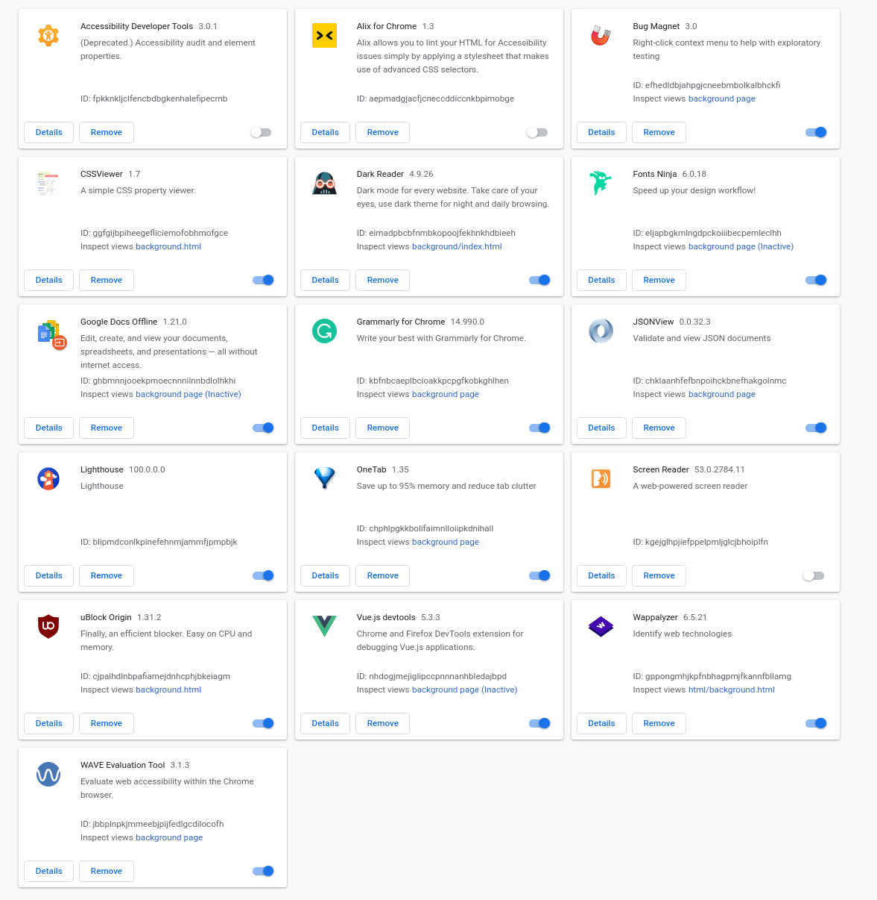

# Chrome

## Extensions

* https://medium.com/javascript-in-plain-english/7-chrome-extensions-every-developer-must-have-d01a9c119d3c

## [Flags](https://medium.com/better-programming/10-awesome-chrome-flags-you-should-enable-right-now-2684e4518cb5)

* https://gizmeek.com/chrome-flags-improve-chrome-performance-chrome-flags

### Try

* chrome://flags/#enable-reader-mode
* chrome://flags/#focus-mode
* chrome://flags/#pdf-two-up-view
* chrome://flags/#enable-force-dark
* chrome://flags/#tab-hover-cards & chrome://flags/#tab-hover-card-images
* chrome://flags/#enable-parallel-downloading
* chrome://flags/#impulse-scroll-animations
* chrome://flags/#enable-quic
* chrome://flags/#global-media-controls

## Devtools

* https://github.com/Janis-Rullis-IT/dev/blob/master/Tools/Devtools/README.md#chrome-devtools
