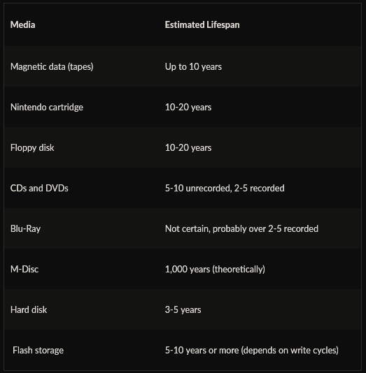

# Long-term data stoarge

* piqlfilm - nano qr on 35mm = 500+ yrs https://cld.bz/users/user-WmA6B3j/Piql-Introduction/8/
* memory crystals = gazillion yrs https://en.wikipedia.org/wiki/5D_optical_data_storage?wprov=sfla1
* https://en.wikipedia.org/wiki/Holographic_Versatile_Disc?wprov=sfla1
* https://en.wikipedia.org/wiki/5D_DVD?wprov=sfla1
* https://en.wikipedia.org/wiki/Hyper_CD-ROM?wprov=sfla1

## Articles
* [Hard-core data preservation: The best media and methods for archiving your data](https://www.pcworld.com/article/2984597/storage/hard-core-data-preservation-the-best-media-and-methods-for-archiving-your-data.html)
* [Data storage lifespans: How long will media really last?](https://www.storagecraft.com/blog/data-storage-lifespan/)

## Conclusion
M-disc is the best choice.

## M-disc Blu-ray quad layer (BDXL 100 - 128GB) burners
* [Best Internal Blu-Ray Burner Rewriter Drive 2017-2018](https://nerdtechy.com/best-internal-blu-ray-burner-rewriter-drive).
* [lg-WH16NS40-internal-blu-ray-dvd-drive](http://www.lg.com/us/burners-drives/lg-WH16NS40-internal-blu-ray-dvd-drive)

### ASUS BC-12D2HT

* [m79.lv](https://m79.lv/datorukomponentes/diskdzini/asus-bc12d2ht-bluray-combo-at-12x-bluray-reading-speed-mdisc-and-bdxl-support#)
* [pcworld.com](https://www.pcworld.co.uk/gbuk/computing-accessories/components-and-upgrades/cd-dvd-and-blu-ray-drives/asus-bc-12d2ht-internal-blu-ray-combo-21857228-pdt.html)

## Pack of 100GB M discs
* [BluRay M-DISC BD-R Verbatim [ jewel case 5 | 100GB | 4x | Inkjet Printable ] matricas](https://m79.lv/datortehnikasaksesuari/matricas/bluray-mdisc-bdr-verbatim--jewel-case-5--100gb--4x--inkjet-printable-)
